<picture>
  <source media="(max-width: 600px) and (prefers-color-scheme: dark)" srcset="./assets/welcome-dark-mobile.svg">
  <source media="(max-width: 600px)" srcset="./assets/welcome-light-mobile.svg">
  <source media="(prefers-color-scheme: dark)" srcset="./assets/welcome-dark.svg">
  
</picture>

# Hey, I'm Aapsi.

**Engineer at [Bloxtel](https://github.com/bloxtel) · Based in India.**

I build across smart contracts, backend systems, and the interfaces that bring them to people. My work has grown from full-stack development into DeFi, protocol security, system design, and decentralized infrastructure. I like understanding the whole system: how it works, where it breaks, and what makes it useful.

[LinkedIn](https://www.linkedin.com/in/aapsi-khaira-308283162/) · [X](https://x.com/AapsiK) · [Email](mailto:aapsikhaira98@gmail.com) · [Writing](https://medium.com/@aapsikhaira98)

## What I work on

- **DeFi & protocol engineering.** Smart contracts, token standards, vaults, and composable financial primitives. Solidity, Yul, Foundry, and Hardhat.
- **System design & infrastructure.** Backend architecture, distributed systems, and the connections between onchain and offchain services. Go, Node.js, and TypeScript.
- **Security & product.** Reasoning about trust boundaries and failure modes, testing assumptions, and building interfaces that make complex systems usable.

## Currently learning & exploring

- **Neuroscience** — how learning, memory, and cognition emerge from connected systems.
- **Institutional RWA** — tokenization, identity, compliance, and the infrastructure connecting real-world assets to onchain finance.
- **Distributed ledger technology (DLT)** — consensus, interoperability, privacy, and the tradeoffs behind shared infrastructure.
- **DeFi & system design** — market mechanisms, protocol risk, and architectures that hold up beyond the happy path.

## Things I've built

**[PolkaSig](https://github.com/aapsi/PolkaSig)** 
A Safe module exploring EVM and Substrate co-signing on Polkadot Hub, with Solidity-to-Rust signature verification. 
Solidity · Rust · PolkaVM · Safe

**[YieldDrip](https://github.com/aapsi/Yield-Drip)** 
A DeFi project combining dollar-cost averaging with yield-bearing capital, built around the 1inch Limit Order Protocol. 
Solidity · ERC-4626 · TypeScript · Next.js

**[MEVSpy](https://github.com/aapsi/MEVSpy)** 
An exploration of MEV detection through graph neural networks and transaction patterns. 
Python · Graph neural networks · Ethereum

More experiments, closer to the metal

- [Yul & Assembly](https://github.com/aapsi/Yul-and-Assembly) — working below Solidity's abstractions.
- [Tokenized Vaults](https://github.com/aapsi/Tokenized-Vaults-ERC4626) — exploring ERC-4626.
- [Uniswap v4 Limit Orders](https://github.com/aapsi/UniswapV4-Limit-Orders) — experimenting with hooks.
- [Build a Blockchain in Go](https://github.com/aapsi/build-a-blockchain-in-go) — learning the machinery by building it.

## Working in the open

I contribute code, tests, and documentation to projects I learn from and build on.

- **Compose:** [ERC-1155 modular facets](https://github.com/Perfect-Abstractions/Compose/pull/286), [ERC-1155 tests](https://github.com/Perfect-Abstractions/Compose/pull/166), and an [ERC-2981 royalty implementation](https://github.com/Perfect-Abstractions/Compose/pull/126).
- **Ethereum EIPs:** [specification and documentation corrections](https://github.com/ethereum/EIPs/pulls?q=is%3Apr+author%3Aaapsi+is%3Amerged).
- **RWA Creator:** [Amoy testnet support in scripts and tooling](https://github.com/PatrickAlphaC/rwa-creator/pull/22).

## Notes from the work

I write to make complex systems easier to reason about.

- [Overview of the Polter Finance Hack](https://coinsbench.com/overview-of-the-polter-finance-hack-d86b839474f5)
- [Building an ERC20 Permit Token on Rootstock](https://rootstock.hashnode.dev/building-an-erc20-permit-token-on-rootstock-a-complete-guide)
- [Writing Secure Contracts: the CEI Pattern](https://rootstock.hashnode.dev/writing-secure-smart-contracts-on-rootstock-the-importance-of-the-cei-pattern)
- [Forking Ethereum Mainnet for Testing with Hardhat](https://medium.com/coinmonks/forking-ethereum-mainnet-a-comprehensive-guide-for-testing-with-hardhat-c78452bf71cb)

More writing

- [Aptos Blockchain: A Developer's Guide](https://medium.com/@aapsikhaira98/aptos-blockchain-a-developers-guide-ed3b27eb0588)
- [Solidity Style Guide: Naming Conventions & Function Order](https://medium.com/coinmonks/solidity-style-guide-correct-naming-convention-and-function-order-a1976eb0a9a2)
- [Solidity Special Comments: NatSpec Format](https://coinsbench.com/solidity-special-comments-natspec-documentation-format-388da664a76a)
- [Deploying ERC721 NFTs on Rootstock Testnet](https://rootstock.hashnode.dev/deploying-an-erc-721-nft-on-rootstock-testnet)

---

**Still curious. Still building.** 
If you're working on useful infrastructure, thoughtful developer tools, or an interesting protocol, [let's talk](mailto:aapsikhaira98@gmail.com).

A little arcade break

<picture>
  <source media="(prefers-reduced-motion: reduce)" srcset="./assets/activity-static.svg">
  <source media="(prefers-color-scheme: dark)" srcset="https://raw.githubusercontent.com/aapsi/aapsi/output/pacman-contribution-graph-dark.svg">
  
</picture>

[View contribution activity](https://github.com/aapsi?tab=overview)

