

  <picture>
    <source media="(prefers-reduced-motion: reduce)" srcset="./assets/pixel-room-still.png">
    
  </picture>

<h1 align="center">Hi, I'm Aapsi</h1>

<b>Engineer at <a href="https://bloxtel.com/">Bloxtel</a> · India</b> Distributed systems · DePIN · RWA tokenization

  <picture>
    <source media="(prefers-reduced-motion: reduce) and (prefers-color-scheme: dark)" srcset="./assets/focus-static-dark.svg">
    <source media="(prefers-reduced-motion: reduce)" srcset="./assets/focus-static-light.svg">
    <source media="(prefers-color-scheme: dark)" srcset="./assets/focus-typing-dark.svg">
    
  </picture>

  
  
  
  

## Currently at Bloxtel

At Bloxtel, my focus is **distributed systems and DePIN**. Bloxtel develops decentralized private 5G infrastructure with onchain identity and tokenized ownership.

  <picture>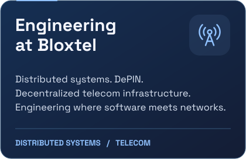</picture>
  <picture>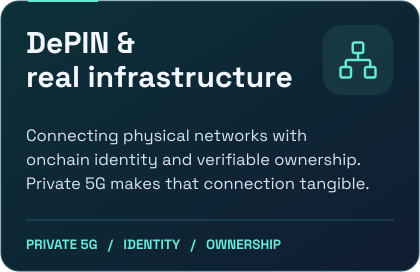</picture>

## Where I go deep

  <picture>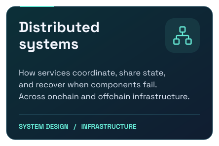</picture>
  <picture>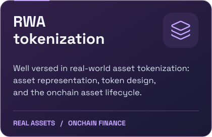</picture>
  <picture>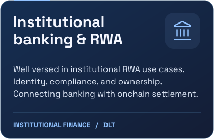</picture>
  <picture>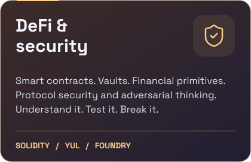</picture>

## Languages & toolkit

  <b>The languages</b>  
  <picture></picture> 
  Go · Rust · TypeScript · JavaScript · Python · Solidity · Yul

  <b>From contracts to interfaces</b>  
  <picture></picture> 
  React · Node.js · Git · Foundry · Hardhat

## Currently loading into my brain

  <picture>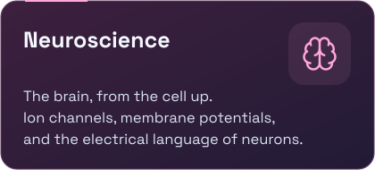</picture>
  <picture>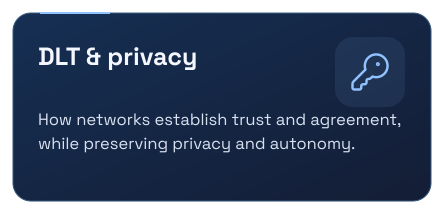</picture>
  <picture>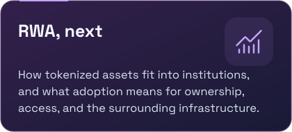</picture>
  <picture>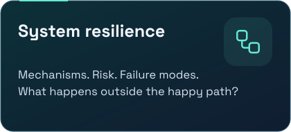</picture>

## The GitHub side of the story

  <picture>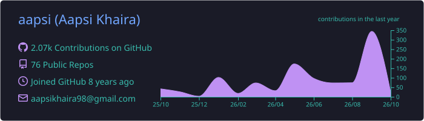</picture> 
  <picture>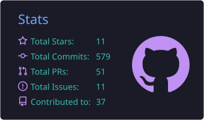</picture>
  <picture>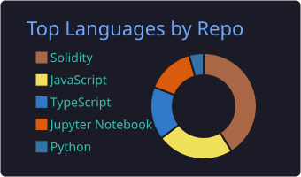</picture> 
  Public GitHub activity · cards refreshed daily

## Things I write & contribute

  <picture>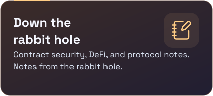</picture>
  <picture>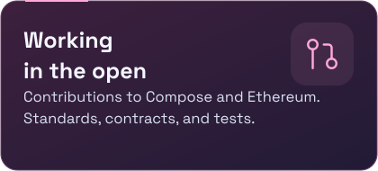</picture>

Selected articles & merged contributions

- [Inside the Polter Finance hack](https://coinsbench.com/overview-of-the-polter-finance-hack-d86b839474f5)
- [ERC20 Permit on Rootstock](https://rootstock.hashnode.dev/building-an-erc20-permit-token-on-rootstock-a-complete-guide)
- [The CEI security pattern](https://rootstock.hashnode.dev/writing-secure-smart-contracts-on-rootstock-the-importance-of-the-cei-pattern)
- Compose: [ERC-1155 facets](https://github.com/Perfect-Abstractions/Compose/pull/286) · [tests](https://github.com/Perfect-Abstractions/Compose/pull/166) · [ERC-2981](https://github.com/Perfect-Abstractions/Compose/pull/126)
- Ethereum: [EIP specification & documentation corrections](https://github.com/ethereum/EIPs/pulls?q=is%3Apr+author%3Aaapsi+is%3Amerged)

Open the reading drawer

- [Forking Ethereum Mainnet for Testing with Hardhat](https://medium.com/coinmonks/forking-ethereum-mainnet-a-comprehensive-guide-for-testing-with-hardhat-c78452bf71cb)
- [Aptos Blockchain: A Developer's Guide](https://medium.com/@aapsikhaira98/aptos-blockchain-a-developers-guide-ed3b27eb0588)
- [Solidity Style Guide](https://medium.com/coinmonks/solidity-style-guide-correct-naming-convention-and-function-order-a1976eb0a9a2)
- [NatSpec Documentation](https://coinsbench.com/solidity-special-comments-natspec-documentation-format-388da664a76a)
- [ERC721 NFTs on Rootstock](https://rootstock.hashnode.dev/deploying-an-erc-721-nft-on-rootstock-testnet)

## Commit. Eat. Repeat.

<picture>
  <source media="(prefers-reduced-motion: reduce)" srcset="./assets/activity-static.svg">
  <source media="(prefers-color-scheme: dark)" srcset="./assets/pacman-dark.svg">
  
</picture>

<b>Always curious. Never quite done.</b> <a href="mailto:aapsikhaira98@gmail.com">Let's talk systems, protocols, or your latest rabbit hole.</a>

